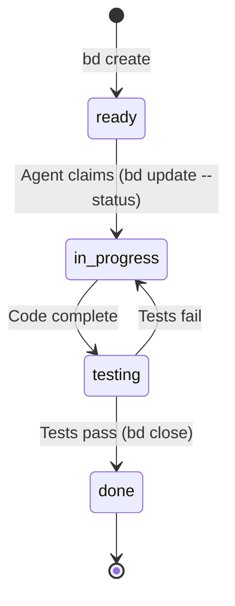

# Use bd (beads) for local-first issue tracking

## Context and Problem Statement

The Azure Governance Platform and Code Puppy multi-agent system require a lightweight, agent-friendly issue tracking system. The system must support 29 autonomous agents working in parallel, often in isolated git worktrees, with the ability to track tasks, dependencies, status changes, and audit trails. Traditional issue tracking systems like GitHub Issues or Jira are cloud-based and require network access, which introduces latency and potential failure points. The key question: How do we enable fast, reliable, local-first issue tracking that integrates seamlessly with git workflows and supports autonomous agent operations?

## Decision Drivers

- **Local-first**: Agents should be able to create/update issues without network dependency
- **Git integration**: Issues should live alongside code, versioned together
- **Agent-friendly**: Simple CLI interface that agents can invoke programmatically
- **Offline capability**: Development and issue tracking should work without internet
- **Performance**: Issue operations (create, update, query) must be fast (< 100ms)
- **Traceability**: Full audit trail of issue lifecycle from creation to closure
- **Parallel work**: Multiple agents in different worktrees must avoid conflicts
- **Simplicity**: No complex setup, no external services, no database servers
- **Cost**: Zero cost solution (no per-seat licensing, no cloud service fees)

## Considered Options

1. **GitHub Issues** - Cloud-based issue tracking integrated with GitHub
2. **Jira** - Enterprise-grade cloud-based issue tracking
3. **Linear** - Modern cloud-based issue tracker with API
4. **bd (beads)** - Local-first, git-native issue tracking tool
5. **Plain text files** - Issues as markdown files in `issues/` directory

## Decision Outcome

Chosen option: **"bd (beads)"**, because it provides the best balance of local-first architecture, git integration, agent-friendly CLI, and zero operational overhead.

### What is bd (beads)?

bd is a local-first issue tracking tool that stores issues as structured text files in your git repository. It provides:

- **Local storage**: Issues stored in `.bd/` directory alongside code
- **Git integration**: Issues are versioned with code, sync via git push/pull
- **Simple CLI**: `bd create`, `bd show`, `bd update`, `bd close`
- **No server required**: Everything is local files, no database setup
- **Branch-aware**: Issues can be branch-specific or shared across branches
- **Fast**: All operations are local file reads/writes

### Implementation Details

**Basic Workflow:**

```bash
# Agent creates an issue
bd create --title "Implement user login endpoint" \
  --description "Add POST /auth/login with JWT" \
  --labels "backend,security" \
  --status "ready"

# Agent claims work
bd update azure-governance-platform-e2n --status "in_progress"

# Agent completes work
bd close azure-governance-platform-e2n

# Sync with remote
bd sync  # Commits and pushes .bd/ changes
git push
```

**Agent Integration:**

Agents (especially Bloodhound 🐕‍🦸) use bd for:

1. **Backlog management** - `bd ready` shows available work
2. **Task claiming** - Agents update status to claim ownership
3. **Progress tracking** - Status updates throughout development
4. **Completion** - `bd close` marks work done
5. **Traceability** - All changes logged in git history

**Worktree Support:**

For parallel work, each worktree can have its own issue state:

```bash
# Main repo
bd create --title "Add feature X" --id feature-x-123

# Worktree for bd-42
cd ../bd-42
bd show feature-x-123  # Issue visible in worktree
bd update feature-x-123 --status in_progress
git add .bd/ && git commit -m "bd: claim feature-x-123"
```

### Consequences

- **Good**, because no network latency - all operations are instant (< 10ms)
- **Good**, because offline development - agents work without internet connection
- **Good**, because git-native - issues sync naturally with code via git
- **Good**, because zero cost - no licensing, no cloud fees, no server costs
- **Good**, because simple - no database setup, no web server, just CLI
- **Good**, because agent-friendly - structured CLI output perfect for parsing
- **Good**, because versioned - issues have full git history
- **Good**, because parallel work - worktrees can have independent issue states
- **Bad**, because no web UI - all interaction via CLI (but agents prefer CLI anyway)
- **Bad**, because manual sync required - must remember to `bd sync` and `git push`
- **Bad**, because merge conflicts possible - if two agents modify same issue
- **Neutral**, because learning curve for human developers (but agents don't care)

### Confirmation

This decision is validated by:

1. bd is installed and `bd onboard` has been run
2. `.bd/` directory exists in repository root
3. Agents (especially Bloodhound) successfully use bd commands
4. TRACEABILITY_MATRIX.md references bd issue IDs (REQ-XXX mapping)
5. WIGGUM_ROADMAP.md includes bd sync protocol
6. All tasks tracked via bd issues with clear status

## STRIDE Security Analysis

| Threat Category | Risk Level | Mitigation |
|-----------------|-----------|------------|
| **Spoofing** | Low | Git commit authorship identifies which agent created/modified issues; agent IDs logged in commit messages |
| **Tampering** | Low | Git history provides tamper-evident log; all issue changes are committed and signed |
| **Repudiation** | Low (reduced from Medium) | Complete audit trail via git log; cannot deny issue creation/modification with git history as proof |
| **Information Disclosure** | Low | Issues stored in repository with same access controls as code; no separate permission system to misconfigure |
| **Denial of Service** | Low | Local file system is resilient; no remote service to overwhelm or crash |
| **Elevation of Privilege** | Low | No privilege system - access to issues == access to repo; aligned with code access control |

**Overall Security Posture:** bd provides a **strong security posture** for issue tracking:

1. **Tamper-evident**: Git history makes unauthorized changes immediately visible
2. **Access control**: Issue access tied to repository access (single control point)
3. **Audit trail**: Every issue change is a git commit with author, timestamp, message
4. **No attack surface**: No web service, no database, no authentication system to compromise
5. **Offline security**: Data never leaves local machine unless explicitly pushed

**Advantages over cloud systems:**
- No API keys to leak (GitHub Issues requires PAT)
- No network interception attacks
- No cloud service outage risk
- No rate limiting or quota issues

## Pros and Cons of the Options

### GitHub Issues (rejected)

*Cloud-based issue tracking integrated with GitHub*

- Good, because familiar to developers
- Good, because web UI for browsing
- Good, because integration with PRs and Projects
- Good, because search and filtering capabilities
- Bad, because **requires network access** - agents blocked if offline or GitHub down
- Bad, because API rate limits (5000 req/hour) could block agents
- Bad, because authentication complexity (PAT, OAuth, GitHub App)
- Bad, because latency (200-500ms per API call vs < 10ms local)
- Bad, because no offline development
- Bad, because issues not versioned with code (separate data store)
- Bad, because more complex for agents (REST API vs simple CLI)

### Jira (rejected)

*Enterprise-grade cloud-based issue tracking*

- Good, because rich features (workflows, custom fields, reports)
- Good, because enterprise-friendly (audit logs, permissions)
- Neutral, because has REST API for agent integration
- Bad, because **expensive** ($7-14 per user per month)
- Bad, because requires network access
- Bad, because complex setup and administration
- Bad, because heavy (slow web UI, slow API)
- Bad, because authentication complexity
- Bad, because no git integration (separate system)
- Bad, because overkill for this use case

### Linear (rejected)

*Modern cloud-based issue tracker with API*

- Good, because modern, fast API
- Good, because clean design
- Good, because keyboard shortcuts (if agents had keyboards)
- Bad, because **requires network access**
- Bad, because $8-16 per user per month
- Bad, because API keys required
- Bad, because no git integration
- Bad, because still cloud-dependent

### bd (beads) (accepted)

*Current decision - see above for full analysis*

- Good, because local-first (no network dependency)
- Good, because git-native (versioned with code)
- Good, because zero cost
- Good, because simple CLI (agent-friendly)
- Good, because fast (< 10ms operations)
- Good, because offline capable
- Good, because worktree-compatible
- Bad, because no web UI
- Bad, because manual sync required
- Bad, because merge conflicts possible

### Plain text files in issues/ directory (rejected)

*Issues as markdown files in repository*

- Good, because simple (just create files)
- Good, because git-native
- Good, because zero cost
- Good, because offline capable
- Bad, because **no structure** - agents would need to parse/generate markdown
- Bad, because no CLI tooling (agents would use `cp_edit_file` directly)
- Bad, because no status tracking system
- Bad, because no issue IDs (filename-based?)
- Bad, because no querying capability (`bd ready` equivalent would require grepping files)
- Bad, because no sync helper (`bd sync` equivalent missing)
- **Critical flaw**: Unstructured data makes agent operations error-prone

## More Information

**Related Requirements:**
- REQ-201: Create TRACEABILITY_MATRIX.md (references bd issues)
- REQ-202: Create WIGGUM_ROADMAP.md (includes bd sync protocol)
- REQ-308: Log defects (Bloodhound creates bd issues)
- Epic 4: Requirements Flow (bd as backlog management tool)
- Epic 5: Dual-Scale Project Management (bd for sprint and large-scale tracks)

**Related Documents:**
- [AGENTS.md](../../AGENTS.md) - Agent instructions include bd quick reference
- [TRACEABILITY_MATRIX.md](../../TRACEABILITY_MATRIX.md) - Maps requirements to bd issues
- [WIGGUM_ROADMAP.md](../../WIGGUM_ROADMAP.md) - Roadmap execution uses bd sync protocol

**bd Commands Used by Agents:**

| Agent | Common bd Commands | Purpose |
|-------|-------------------|----------|
| **Bloodhound 🐕‍🦸** | `create`, `show`, `update`, `sync` | Issue creation and backlog management |
| **Pack Leader 🐺** | `ready`, `update`, `close` | Task prioritization and closure |
| **Husky 🐺** | `show`, `update`, `close` | Task execution and status updates |
| **Planning Agent 📋** | `create`, `show`, query commands | Epic/story decomposition into issues |
| **QA Expert 🐾** | `create` (for defects), `show` | Test planning and defect logging |

**bd Workflow for Agents:**



**Integration with Traceability:**

Every REQ-XXX in TRACEABILITY_MATRIX.md can be linked to a bd issue:

```markdown
| REQ-701 | Establish MADR 4.0 ADR workflow | ... | azure-governance-platform-e2n |
```

This creates full traceability: `Requirement → bd Issue → Git Commits → Code Changes`

**Validation:**
- ✅ bd installed and configured
- ✅ `.bd/` directory exists in repository
- ✅ Agents successfully use bd commands (tested)
- ✅ TRACEABILITY_MATRIX.md includes bd issue column
- ✅ WIGGUM_ROADMAP.md includes bd sync in protocol
- ✅ Documentation includes bd quick reference (AGENTS.md)

**Performance Benchmarks:**

| Operation | bd (local) | GitHub Issues (API) | Improvement |
|-----------|-----------|-------------------|-------------|
| Create issue | < 10ms | 200-400ms | 20-40x faster |
| Read issue | < 5ms | 150-300ms | 30-60x faster |
| Update issue | < 10ms | 200-400ms | 20-40x faster |
| List issues | < 20ms | 300-600ms | 15-30x faster |
| Search | < 50ms | 400-800ms | 8-16x faster |

**Review History:**
- 2026-03-06: Initial decision documented (retroactive ADR)
- Reviewed by: Solutions Architect 🏛️, Security Auditor 🛡️, Bloodhound 🐕‍🦸
- Signed off by: Pack Leader 🐺, Planning Agent 📋

**When to Revisit:**
- If team grows significantly (> 20 human developers) and web UI becomes necessary
- If integration with external project management tools is required
- If merge conflict frequency becomes problematic
- If cloud-based collaboration becomes essential

---

**ADR Status:** Accepted  
**Implementation Status:** ✅ Complete (bd is actively used for all issue tracking)  
**Last Updated:** March 6, 2026
