# Azure Governance Platform

Production-ready multi-tenant Azure governance platform for Head-to-Toe Brands
(Riverside Capital portfolio company). This page is the self-updating project
hub — every push to `main` refreshes the audit status, topology diagram, and
Riverside timeline below.

## Live links

- **Project board** — <https://github.com/orgs/htt-brands/projects> (pinned board: Azure Governance)
- **Repository** — <https://github.com/htt-brands/azure-governance-platform>
- **Staging app** — <https://app-governance-staging-xnczpwyv.azurewebsites.net>

## What's on this page

- [Platform status](status.md) — tenant health, consent, UI-fixture leaks (refreshed from `scripts/audit_output.json`).
- [Riverside timeline](riverside-timeline.md) — countdown to **July 8, 2026** and per-domain maturity.
- Architecture diagram — embedded below (regenerated from Azure Resource Graph on every push).

## Architecture

_Source: [`docs/diagrams/architecture.mmd`](diagrams/architecture.mmd)_

## Azure topology (live)

The live topology diagram is generated from Azure Resource Graph via OIDC and
updated on every push. See [`docs/diagrams/topology.mmd`](diagrams/topology.mmd).

## How this page updates

| Trigger | Updates |
|---|---|
| PR opened / closed / labeled | Project v2 item fields (Status, Persona, Tenant, Priority, Riverside ID) |
| Push to `main` | `topology.mmd` regenerated via Resource Graph |
| Weekly (Mondays 07:00 UTC) | `topology.svg` + `topology.drawio` refresh |
| Push to `main` touching `docs/**` or `scripts/audit_output.json` | This page rebuilds; `status.md` re-rendered from the latest audit |
